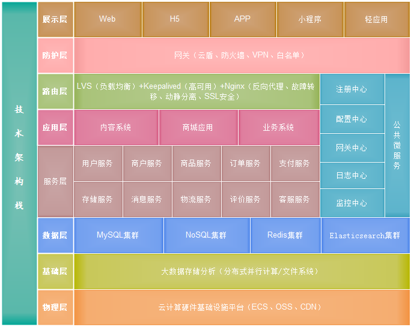
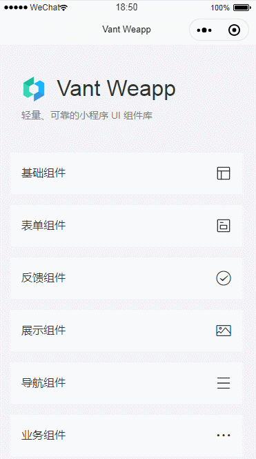
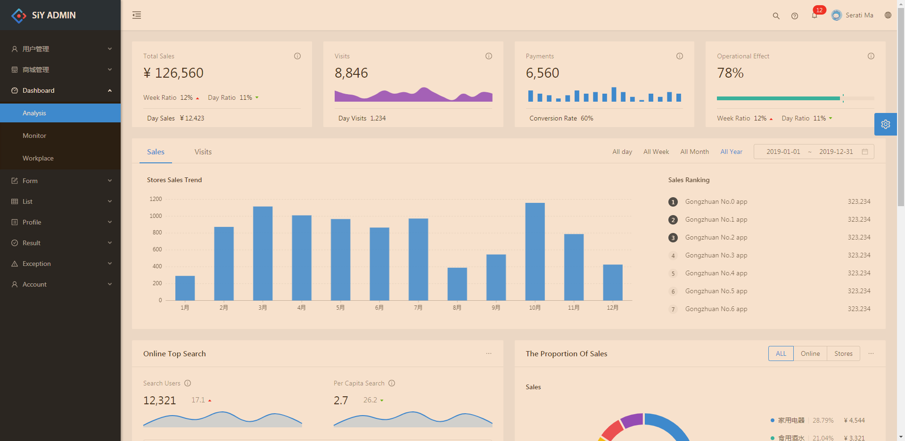

SiY |  基于微服务的移动商城系统
---
SiY是基于Spring Cloud开发的分布式移动商城系统，包括注册中心、配置中心、网关中心等微服务基础服务模块，以及用户中心、商家中心、商品中心、订单中心、支付中心等业务服务模块，和微信端、管理平台两大聚合服务模块，支持服务治理、监控和追踪等功能。

## 组织结构

```
SiY
├── siy-common -- 框架公共模块
├── siy-eureka-server -- eureka注册中心[端口:8761]
├── siy-config-server -- 配置中心
├── siy-api-gateway -- api网关[端口:8020]
├── siy-hystrix-dashboard -- 断路器监控面板[端口:1301]
├── siy-example -- 项目示例工程
|    ├── siy-example-api -- 远程服务api接口
|    ├── siy-example-provider -- 服务提供方[端口:9998]
|    ├── siy-example-consumer -- 服务消费方[端口:9999]
├── siy-user-api -- 用户中心api
├── siy-user -- 用户中心基础服务
├── siy-goods-api -- 商品中心api
├── siy-goods -- 商品中心基础服务
├── siy-order-api -- 订单中心api
├── siy-order -- 订单中心基础服务
├── siy-storage-api -- 对象存储服务api
├── siy-storage -- 对象存储服务
├── siy-wechat -- 微信端聚合服务
├── siy-wechat-ui -- 微信小程序页面
├── siy-wechat-vanui -- 微信小程序ui库
├── siy-admin -- 管理平台聚合服务
├── siy-admin-ui -- 管理平台页面
├── siy-pay-api -- 支付中心api
├── siy-pay -- 支付中心基础服务
```

> 应用架构



### 后端技术

技术 | 名称 | 版本 | 官网
----|------|----|----
Spring Boot | 应用框架 | 2.1.2.RELEASE | [https://projects.spring.io/spring-boot/](https://projects.spring.io/spring-boot/)
spring-cloud-netflix | 微服务框架 | Greenwich.RELEASE | [https://projects.spring.io/spring-cloud/](https://projects.spring.io/spring-boot/)
MyBatis | ORM框架 | 3.2.1 |  [http://www.mybatis.org/mybatis-3/zh/index.html](http://www.mybatis.org/mybatis-3/zh/index.html)
Mapper | MyBatis 通用 Mapper4 | 4.0.0 |  [https://gitee.com/free/Mapper](https://gitee.com/free/Mapper)
MyBatis Generator | 代码生成 | 1.3.5 |  [http://www.mybatis.org/generator/index.html](http://www.mybatis.org/generator/index.html)
Swagger2 | 在线Api文档 | 2.9.2 |  [https://swagger.io/](https://swagger.io/)
Thymeleaf | 模板引擎 | 3.0.9.RELEASE |  [https://www.thymeleaf.org/](https://www.thymeleaf.org/)
Logback | 日志组件 | 1.1.3 |  [https://logback.qos.ch](https://logback.qos.ch/)
Druid | 数据库连接池 | 0.2.23 |  [https://github.com/alibaba/druid](https://github.com/alibaba/druid)
Hibernate Validator | 后端校验框架 | 5.4.2.Final | [http://hibernate.org/validator/](http://hibernate.org/validator/)
RabbitMQ | 消息中间件 | 5.4.3 | [http://www.rabbitmq.com/](http://www.rabbitmq.com/)
Redis | 缓存 | 5.0.3 | [https://redis.io/](https://redis.io/)
Zipkin | 链路追踪 | 2.12.0 | [https://zipkin.io/](https://zipkin.io/)

### 前端技术

技术 | 名称 | 版本 |  官网
----|------|----|----
React | 前端JS框架 | 16.5.1 |  [https://reactjs.org/](https://reactjs.org/)
Ant Design Pro | 开箱即用的中台前端/设计解决方案 | 2.1.0 |  [https://pro.ant.design/index-cn](https://pro.ant.design/index-cn)
vant-weapp | 轻量、可靠的小程序 UI 组件库 | 0.5.20 | [https://youzan.github.io/vant-weapp](https://youzan.github.io/vant-weapp)

### 软件需求

- JDK1.8+
- MySQL5.6+
- RabbitMQ 3.6.x+
- Maven3.0+
- ZipKinServer 3.7.0+

## 功能

### 商城功能

- 首页
- 专题列表、专题详情
- 分类列表、分类详情
- 品牌列表、品牌详情
- 新品首发、人气推荐
- 团购
- 搜索
- 商品详情、商品评价、商品分享
- 购物车
- 下单
- 订单列表、订单详情
- 地址、收藏、足迹、意见反馈
- 客服

### 管理平台功能

- 会员管理
- 商城管理
- 商品管理
- 推广管理
- 系统管理

## 当前进度与计划

- [x]  公众号文章同步
- [x]  文章列表、文章详情展示
- [x]  分享、点赞、收藏功能实现
- [x]  评论相关展示和功能实现
- [x]  生成海报功能的实现
- [x]  评论消息通知功能的实现
- [x]  专题、标签相关功能的实现
- []  后台管理功能实现

### 在线演示

。。。

### 预览图

> 商城小程序页面


> 商城UI组件库



> 管理后台页面



## 安装教程

### 本地部署

1. 通过git拉取代码
2. 创建数据库shop，数据库编码为UTF-8
3. 执行docs/sql/data.sql文件，初始化数据
4. 修改配置中心(siy-config-server)的database.properties和common.properties文件，更新MySQL账号和密码，更新RabbitMQ配置，更新zipkinServer配置
5. 运行Maven命令mvn install(注意：安装siy-admin-ui模块因为会运行npm install和npm build命令时间会比较长，当然也可以手动在siy-admin-ui模块执行npm命令)
6. 安装siy-admin-ui模块，运行mvn install和mvn build命令，运行命令前需要安装nodeJs
7. 运行siy-eureka-server、siy-config-server、siy-api-gateway这几个基础服务
8. 运行siy-user、siy-goods、siy-order、siy-pay这几个api服务
9. 运行siy-wechat、wechat-admin这几个endpoint
10. http://localhost:8027/index.html访问后台管理，http://localhost:8020/siy/swagger-ui.html访问Swagger页面
11. 打开微信开发者工具，导入siy-wechat-ui模块,点击编译即可，此时可以预览商城效果

### 生产部署

最低部署要求  1C2G x3

### 获取代码

http://192.168.10.245/chit/shop.git

